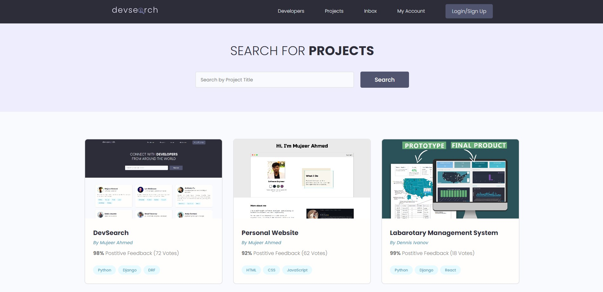
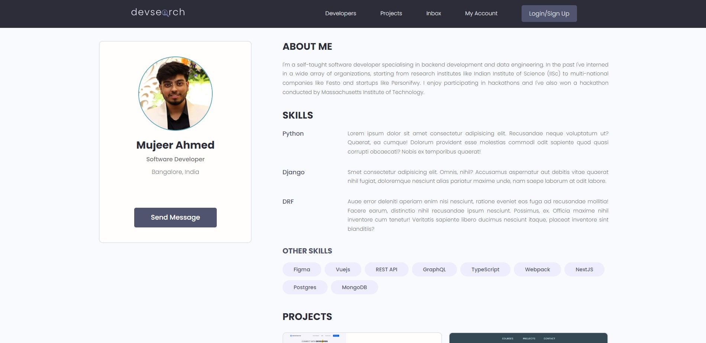
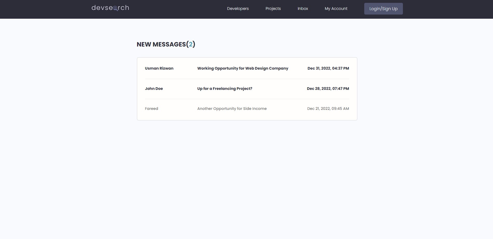

# DevSearch

DevSearch is a hiring platform for HRs to find developers with relevant talent and appropriate project experience. I'm working on adding a video calling feature based on WebRTC which will enable HRs to conduct interviews, chat and browse potential candidates all in one platform.

# Installation

- 1 - clone repo from url
- 2 - create a virtual environment and activate
- - pip install virtualenv
- - virtualenv envname
- - envname\scripts\activate
- 3 - cd into project "Devsearch"
- 4 - pip install -r requirements.txt
- 5 - python manage.py runserver

# Features

- Share Projects
- Message other developers
- Rate others work
- Search other developers

# Tech Stack

- Django
- Postgres
- Django REST Framework

# Home Page

# Projects Page

# Profile Page

# Log-in Page

# User Inbox

